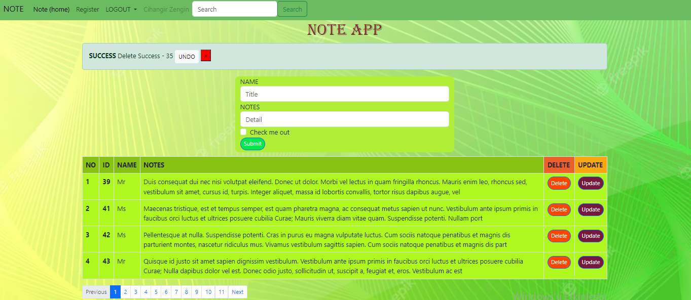
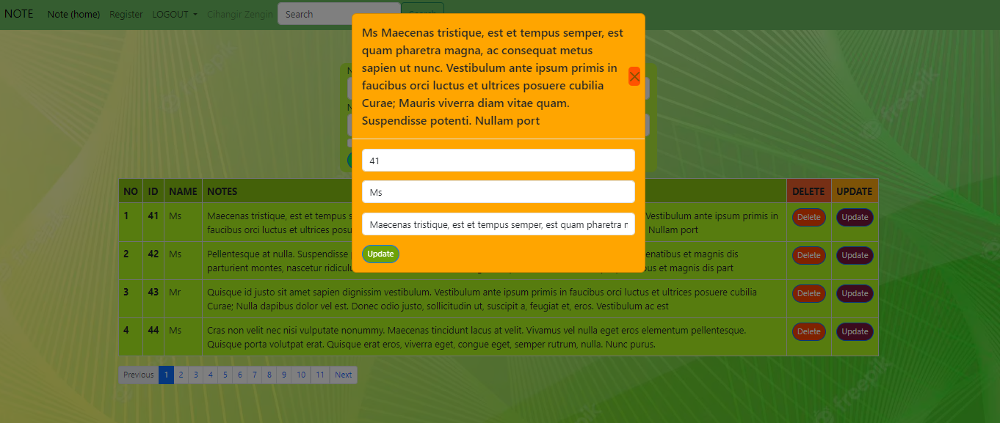
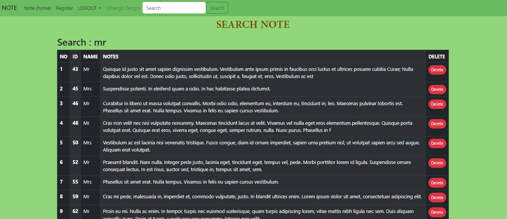
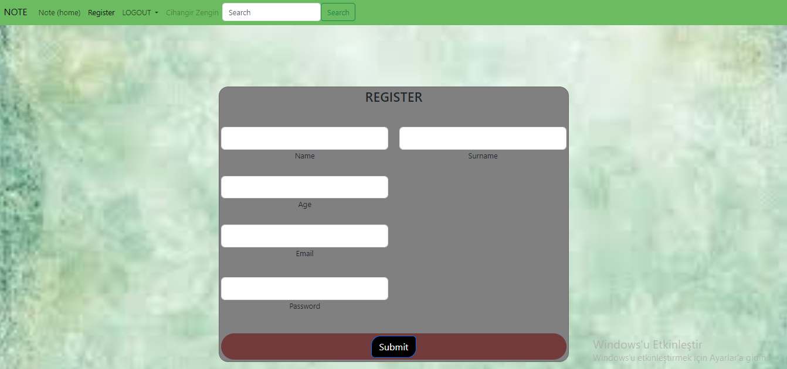

# Spring-Mvc-Note-App
<p> 
After a consumer or a regular user saves the admin control user input, it provides a dynamic service such as adding user and notes, deleting and updating their notes, and provides a dynamic service.

JAVA, SPRING BOOT, MYSQL,  THYMELEAF,HTML 5,CSS, BOOTSTRAP technologies are used in the application.
</p>

# Software Versions:
- Java 8
- Spring 2.17.3
- Mysql 8
- HTML 5
- CSS
- Bootstrap
    
# Application Features:
- [x] User Login
- [x] User Add
- [x] Note Listing
- [x] Note Searching
- [x] Note Update
- [x] Note Delete
- [x] Note Delete/Undo
- [x] User Logout  

## Project Note:
```
In this application, session cookie and encryption with GoogleTink are used.
```


# Project Life Cycle


# Project Display Image

<p>
<a>
     
</a>
    <a>
     
</a>
       <a>
     
</a>
       <a >
     
</a>
       <a >
     
</a>
</p>
